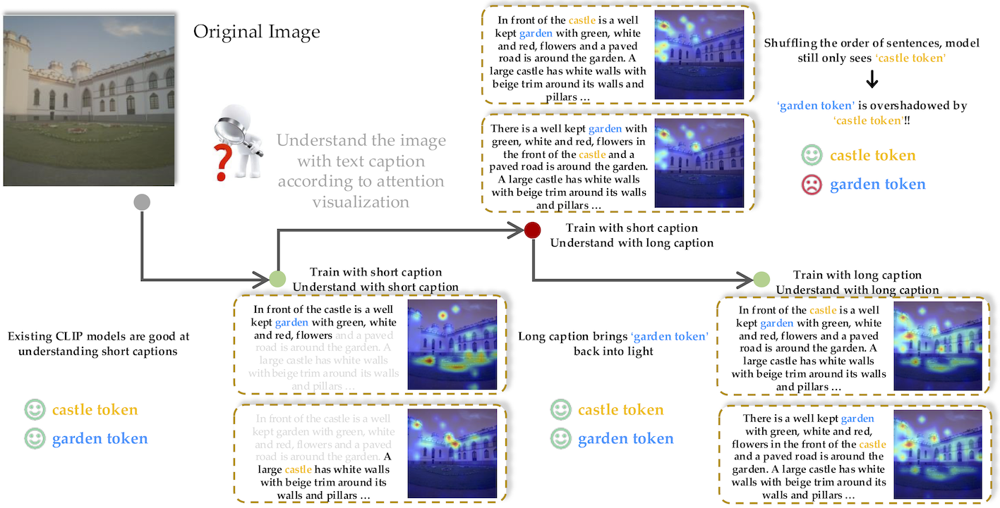

# LoTLIP: Improving Language-Image Pre-training for Long Text Understanding

 Wei Wu, Kecheng Zheng, Shuailei Ma, Fan Lu, Yuxin Guo, Yifei Zhang, Wei Chen, Qingpei Guo, Yujun Shen, Zheng-Jun Zha<br>

**NeurIPS 2024**
#### | [Project Page](https://wuw2019.github.io/lot-lip/) | [Paper](https://arxiv.org/pdf/2410.05249) | [Long Caption-CC](https://huggingface.co/datasets/qidouxiong619/dreamlip_long_captions) | [Long Caption-LAION](https://huggingface.co/datasets/weiwu-ww/Recap-Long-Laion) | [Long Caption-COYO](https://huggingface.co/datasets/weiwu-ww/Recap-Long-Coyo) |

## 📬 News

- [2024/11/26] Release long captions of LAION and COYO in huggingface.
- [2024/10/20] Upload LoTLIP checkpoints and evaluation code for LoTLIP.
- [2024/10/13] Upload long text-image retrieval evaluation for CLIP.
- [2024/09/26] 🎉 LoTLIP is accepted by NeurIPS 2024!


## 💡 Highlights
- 🔥 Enhancing the long text understanding ability of language-image pre-training model.

- 🔥 Models trained on short text-image datasets tend to neglect certain tokens in long texts.


- 🔥 New long text-image retrieval benchmark.


## 💻 How to Install


```
conda create -n lotlip python=3.9
conda activate lotlip

make install-training
make install-test
```


## 🗒 Long Text-Image Retrieval

### Data Preparation
Preparing Datasets for long text-image retrieval following [EVAL_DATASETS.md](EVAL_DATASETS.md)

### Pre-trained Weights Preparation
Please download pre-trained weights of [BERT](https://huggingface.co/google-bert/bert-base-uncased), [ViT-B-16-in21k](https://huggingface.co/timm/vit_base_patch16_224.augreg_in21k), and [ViT-B-32-in21k](https://huggingface.co/timm/vit_base_patch32_224.augreg_in21k) to cache-dir.

```
$cache-dir/
|–– vit_base_patch16_224.augreg_in21k/
|–– vit_base_patch32_224.augreg_in21k/
|–– bert-base-uncased/
```

### How to evaluate
- Evaluate CLIP-ViT-B-16 from openai (pretrained on 400M scale dataset):
```
python -m training.main \
    --share4v-retrieval $path_to_SA-1B_dataset$ \
    --share4v-anno dataloaders/share4v/share4v_sam_10k.json \
    --share4v_val_num 1000,10000 \
    --dci-retrieval $path_to_dci_dataset$ \
    --iiw-retrieval $path_to_iiw_dataset$ \
    --model ViT-B-16 \
    --pretrained 'openai'
```

- Evaluate LoTLIP-ViT-B-16 (pretrained on 100M scale dataset):

Download [LoTLIP-ViT-B-16](https://huggingface.co/weiwu-ww/LoTLIP-ViT-B-16-100M) to path_to_lotlip_checkpoints/

Note: If you built the environment before 2024/10/20, please run **pip install transformers==4.39.3** before evaluation. 

```
python -m training.main \
    --share4v-retrieval $path_to_SA-1B_dataset$ \
    --share4v-anno dataloaders/share4v/share4v_sam_10k.json \
    --share4v_val_num 1000,10000 \
    --dci-retrieval $path_to_dci_dataset$ \
    --iiw-retrieval $path_to_iiw_dataset$ \
    --cache-dir $cache-dir$ \
    --model lotlip_bert-ViT-B-16 \
    --pretrained $path_to_lotlip_checkpoints$/model.pt
```

 ### Evaluation Results

| Model |Pre-training Data Scale   | DCI I2T | DCI T2I| IIW I2T |IIW T2I| SV-10k I2T | SV-10k T2I |
|  :----: | :----: | :----: | :----: | :----: | :----: | :----: | :----: |
| [CLIP-ViT-B-32](https://openaipublic.azureedge.net/clip/models/40d365715913c9da98579312b702a82c18be219cc2a73407c4526f58eba950af/ViT-B-32.pt) |  400M | 43.06 | 40.32 | 86.76 | 84.15 | 58.08 | 51.77|
| [LoTLIP-ViT-B-32](https://huggingface.co/weiwu-ww/LoTLIP-ViT-B-32-100M) |  100M | *59.90* | *56.36* | *93.14*| *91.83* | *83.76* | *78.97*|
| [Long-CLIP-ViT-B-16](https://github.com/beichenzbc/Long-CLIP) |  400M | 51.68 | 57.28 | 89.61 |93.20 |79.24|77.06 |
| [CLIP-ViT-B-16](https://openaipublic.azureedge.net/clip/models/5806e77cd80f8b59890b7e101eabd078d9fb84e6937f9e85e4ecb61988df416f/ViT-B-16.pt) |  400M | 45.45 | 43.01 | 88.24 |87.58 |60.22|56.16 |
| [LoTLIP-ViT-B-16](https://huggingface.co/weiwu-ww/LoTLIP-ViT-B-16-100M) |  100M | *64.11*| *62.63*| *94.28* | *92.65*| *88.40* | *82.72* |

- <span style="color:blue">[2024/11/13]</span> We update the evaluation of Long-CLIP and its performance on the long-text-image retrieval tasks.

## 🔷 Bibtex


```bibtex
@inproceedings{LoTLIP,
  title={LoTLIP: Improving Language-Image Pre-training for Long Text Understanding},
  author={Wu, Wei and Zheng, Kecheng and Ma, Shuailei and Lu, Fan and Guo, Yuxin and Zhang, Yifei and Chen, Wei and Guo, Qingpei and Shen, Yujun and Zheng-Jun, Zha},
  booktitle={arXiv},
  year={2024}
}
```

## ❤️ Acknowledgements

Our code is built on top of [open_clip](https://github.com/mlfoundations/open_clip). Thanks for their nice work!

Thanks to [DCI](https://github.com/facebookresearch/DCI), [IIW](https://github.com/google/imageinwords/) and [ShareGPT4V](https://sharegpt4v.github.io/) for their valuable datasets, which are used in our long-text-image retrieval benchmark.

We also thank [InstructBLIP](https://github.com/salesforce/LAVIS), [ShareGPT4V](https://github.com/InternLM/InternLM-XComposer) and [LLAVA](https://github.com/haotian-liu/LLaVA) for the pretrained models and codes.

